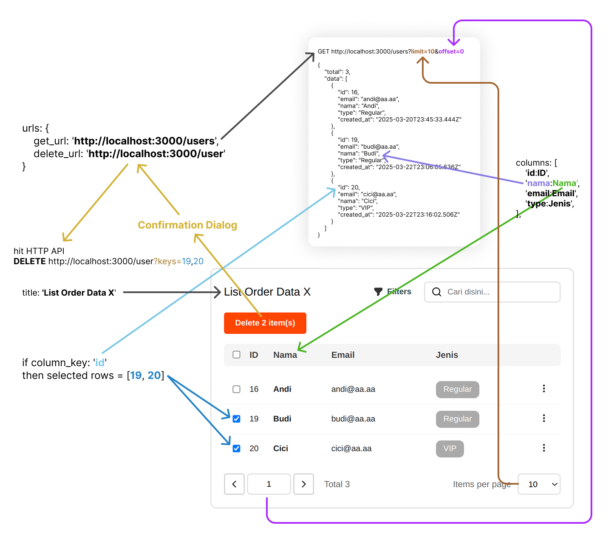

# Co Admin View

## Install

```bash
yarn add co-admin-view
```

```bash
npm install --save co-admin-view
```

## How to Use

### General Table



### Table Search & Filter


### Form Data


## Usage Example


```tsx
// lokasi import css mungkin berbeda-beda tergantung framework yang digunakan
// pada NextJS, tambahkan import css di _app.tsx
// pada Create React App tambahkan di file yang sama
import 'co-admin-view/dist/index.css'

import { CAInput, CAPage } from "co-admin-view";

export function Minimal() {
  const table: CAInput.TableStructure = {
    title: 'List Order Data X',
    columns: [
      'id:ID',
      'nama:Nama',
      'email:Email',
      'phone_number:Nomor HP',
      'type:Jenis',
      'tanggal_lahir:Tgl. Lahir',
      'alamat:Alamat'
    ],
    column_key: 'id',
    urls: {
      get_url: 'http://localhost:3000/users'
    }
  };

  return (
    <CAPage
      title={'Users'}
      table={table} />
  );
}
```

```tsx
import 'co-admin-view/dist/index.css'

import { CAInput, CAPage } from "co-admin-view";

export function Preview() {
  const table: CAInput.TableStructure = {

    // General
    title: 'List Order Data X',
    columns: [
      'id:ID',
      'nama:Nama',
      'email:Email',
      'phone_number:Nomor HP',
      'type:Jenis',
      'tanggal_lahir:Tgl. Lahir',
      'alamat:Alamat'
    ],
    column_key: 'id',
    urls: {
      get_url: 'http://localhost:3000/users',
      delete_url: 'http://localhost:3000/user'
    },

    // Search & Filter
    search_query_key: 'q',
    filters: [
      'freetext:nama:Nama Lengkap',
      'select:type:User Type',
      'select:fb:F-B'
    ],
    filter_options_data_source: [
      'type,fb@http://localhost:3000/user/types'
    ],

    // Advanced Features
    request_init: {
      get: {
        headers: {
          'Authorization': 'Bearer XYZ'
        }
      }
    },
    custom_view: {
      nama(value: string) {
        return (
          <div style={{ color: 'red', fontWeight: 'bold' }}>{ value }</div>
        );
      },
      type(value: string) {
        return (
          <div style={{ display: 'flex' }}>
            <div 
              style={{
                borderRadius: 8,
                padding: '6px 12px',
                background: '#AAA',
                color: 'white'
              }}>
              { value }
            </div>
          </div>
        );
      }
    }
  };

  const form: CAInput.FormStructure = {
    
    // General
    title: 'User Data',
    items: [
      'Section A',
      'INPUT-TEXT:nama:nama:Nama',
      [
        'INPUT-TEXT:email:email:Email',
        'INPUT-TEXT:phone_number:phone_number:Nomor HP',
      ],
      [
        'SELECT:type:type:Jenis',
        'INPUT-TEXT:tanggal_lahir:tanggal_lahir:Tanggal Lahir (YYYY-MM-DD)',
      ],
      'TEXTAREA:alamat:alamat:Alamat',
      'INPUT-NUMBER:n:n:N',
    ],
    options_data_source: [
      'type@http://localhost:3000/user/types'
    ],
    urls: {
      get_detail_url: 'http://localhost:3000/user',
      create_new_url: 'http://localhost:3000/user',
      update_data_url: 'http://localhost:3000/user'
    },

    // Advanced Features
    custom_view: {
      alamat(value: string, setValue: (value: string) => void) {
        return (
          <textarea
            style={{ outline: 'none' }}
            value={value}
            onChange={e => setValue(e.target.value)} />
        );
      }
    },
    allow_anonymous_data_key: true
  };

  return (
    <CAPage
      title={'Orders Data'}
      table={table}
      form={form} />
  );
}
```

## API Specification

### Table GET

#### Request

##### Query

Basic
- `limit` number (required)
- `offset` number (required)

Search
- `<search query key>` string (optional). _Look at Table Search & Filter diagram above_


Filters
- `<filter key 1>` string (optional). _Look at Table Search & Filter diagram above_
- `<filter key 2>` string (optional). _Look at Table Search & Filter diagram above_
- `<filter key N>` string (optional). _Look at Table Search & Filter diagram above_

#### Response

- `total` number
- `data` array of object. Object must be at least contains all keys from columns specifications. _Look at General Table diagram above_.

#### Example

URL `http://localhost:3000/users`

Request

```bash
curl -X GET 'http://localhost:3000/users?limit=10&offset=0&q=Andi&nama=&type=Regular'
```

Response

```json
{
  "total": 4,
  "data": [
    {
      "id": 16,
      "email": "andi@aa.aa",
      "phone_number": "08121111111",
      "nama": "Andi",
      "type": "Regular",
      "tanggal_lahir": "2020-01-09T17:00:00.000Z",
      "alamat": "Bandung 999",
      "created_at": "2025-03-20T23:45:33.444Z"
    },
    ...
  ]
}
```

### Table DELETE

#### Request

##### Query

- `keys` string (required). String contains array of `<column key>` with comma separated value. _Look at Table General Table diagram above_

#### Response

Any response is accepted as long as returned HTTP code 200 (OK)

#### Example

URL `http://localhost:3000/user`

Request

```bash
curl -X DELETE 'http://localhost:3000/user?keys=16,18,20'
```

Response

```json
true
```

### Form GET Detail Data

#### Request

##### Query

- `key` string (required). Key is extracted from selected row on table with data key of `<column key>` (see table specifications).

#### Response

Object where at least contains all keys from columns specifications. _Look at General Table diagram above_.

#### Example

URL `http://localhost:3000/user`

Request

```bash
curl -X GET 'http://localhost:3000/user?key=16'
```

Response

```json
{
  "id": 16,
  "email": "andi@aa.aa",
  "phone_number": "08121111111",
  "nama": "Andi",
  "type": "Regular",
  "tanggal_lahir": "2020-01-09T17:00:00.000Z",
  "alamat": "Bandung 999",
  "created_at": "2025-03-20T23:45:33.444Z"
}
```

### Form POST Create Data

#### Request

##### Headers

- `Content-Type` → `application/json`

##### Body

- `<column key 1>` string/number/boolean/object (required). Key is defined on form data `<items>` specification. _Look at Form Data diagram above_.
- `<column key 2>` string/number/boolean/object (required). Key is defined on form data `<items>` specification. _Look at Form Data diagram above_.
- `<column key N>` string/number/boolean/object (required). Key is defined on form data `<items>` specification. _Look at Form Data diagram above_.

#### Response

Any response is accepted as long as returned HTTP code 200 (OK)

#### Example

URL `http://localhost:3000/user`

Request

```bash
curl -X POST 'http://localhost:3000/user' \
  -H 'Content-Type: application/json' \
  --data-raw '{"nama":"Didi","email":"didi@aa.aa","phone_number":"081233","type":"VIP","tanggal_lahir":"2020-02-02","alamat":"test"}'
```

Response

```json
{
  "id": 22,
  "email": "didi@aa.aa",
  "phone_number": "081233",
  "nama": "Didi",
  "type": "VIP",
  "tanggal_lahir": "2020-01-09T17:00:00.000Z",
  "alamat": "test",
  "created_at": "2025-03-20T23:45:33.444Z"
}
```

### Form PUT Update Data

#### Request

##### Headers

- `Content-Type` → `application/json`

##### Query

- `key` string (required). Key is extracted from selected row on table with data key of `<column key>` (see table specifications).

##### Body

- `<column key 1>` string/number/boolean/object (required). Key is defined on form data `<items>` specification. _Look at Form Data diagram above_.
- `<column key 2>` string/number/boolean/object (required). Key is defined on form data `<items>` specification. _Look at Form Data diagram above_.
- `<column key N>` string/number/boolean/object (required). Key is defined on form data `<items>` specification. _Look at Form Data diagram above_.

#### Response

Any response is accepted as long as returned HTTP code 200 (OK)

#### Example

URL `http://localhost:3000/user`

Request

```bash
curl -X PUT 'http://localhost:3000/user?key=22' \
  -H 'Content-Type: application/json' \
  --data-raw '{"nama":"Dedi","email":"didi@aa.aa","phone_number":"081233","type":"VIP","tanggal_lahir":"2020-02-02","alamat":"Jalan Jakarta"}'
```

Response

```json
{
  "id": 22,
  "email": "didi@aa.aa",
  "phone_number": "081233",
  "nama": "Dedi",
  "type": "VIP",
  "tanggal_lahir": "2020-01-09T17:00:00.000Z",
  "alamat": "Jalan Jakarta",
  "created_at": "2025-03-20T23:45:33.444Z"
}
```
